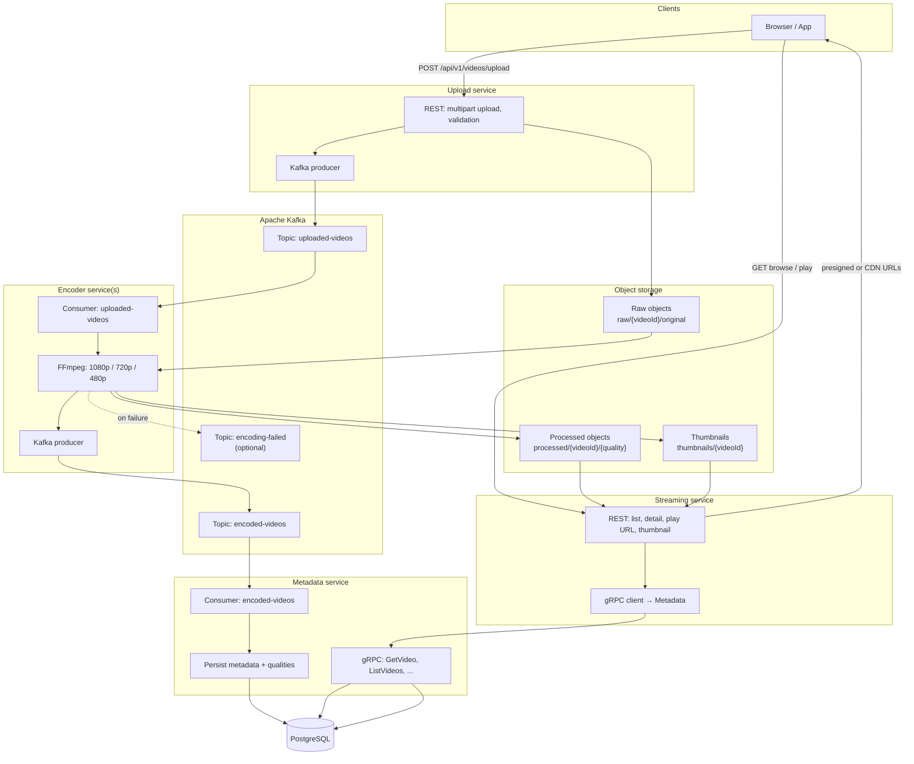

# VideoVault

**VideoVault** models how streaming-oriented systems ingest, transform, store, and deliver video at scale.

The design follows patterns common to platforms like YouTube, Netflix, and Vimeo: a single upload is processed into multiple quality tiers so playback can adapt to device and network constraints.

## Background

Video platforms stress typical backends in several ways:

- High-throughput ingestion for large media files
- Asynchronous pipelines for CPU-heavy work (encoding/transcoding)
- Reliable communication between services that evolve independently
- Durable object storage plus queryable metadata
- Playback paths that stay responsive under load

VideoVault addresses these concerns with a microservice layout and an event-driven backbone (Kafka) so upload, encode, and delivery can scale and fail independently.

## Use cases

This shape of system shows up in:

- OTT and media streaming products
- User-generated content platforms
- E-learning with video
- Internal corporate media libraries
- Any pipeline where large artifacts are processed asynchronously

The same event-driven pattern generalizes to non-video workloads (document conversion, image pipelines, ML preprocessing, etc.).

## Architecture

Services communicate asynchronously through Kafka; synchronous calls are used where a client or service needs an immediate answer (upload HTTP API, streaming API + metadata lookup).



**Flow in short:** upload lands in object storage and emits `uploaded-videos`; encoder workers consume that topic, write renditions back to storage, and emit `encoded-videos`; metadata service materializes rows in PostgreSQL and serves other backends via gRPC; the streaming service exposes HTTP for browsers and resolves playback URLs from metadata and storage.

## Technology

### Backend

- **Go**: service implementations
- **gRPC**: internal APIs (e.g. metadata)
- **REST**: upload and streaming boundaries

### Events and media

- **Apache Kafka**: topics such as `uploaded-videos`, `encoded-videos`, optional `encoding-failed`
- **FFmpeg**: transcoding to multiple profiles

### Data

- **PostgreSQL**: metadata and indexing
- **S3-compatible storage**: raw files, encoded outputs, thumbnails

### Platform

- **Docker / Compose**: local full-stack runs
- **Health checks / metrics hooks**: operability (e.g. `/healthz`, Prometheus-friendly instrumentation)

### Frontend

- **Next.js**: upload UI, library, player (when wired)

## Week 1 Starter Setup

This repository now includes a Week 1 learning-first starter for the `upload-service`:

- `services/upload-service`: Go API with `/healthz`, `/readyz`, and upload/status endpoints
- `docker-compose.yml`: local Kafka, Kafka UI, PostgreSQL, and upload-service
- YAML config with env override support (`viper`) for future extensibility

### Prerequisites

- Go 1.22+
- Docker + Docker Compose
- `make` (optional, but convenient)

### Install Dependencies

```bash
cd services/upload-service
go mod tidy
```

### Run Locally (without Docker)

```bash
cd services/upload-service
make run
```

### Run Full Local Stack (with Docker)

```bash
docker compose up --build
```

Useful local URLs:

- Upload service: `http://localhost:8080`
- Kafka UI: `http://localhost:8081`
- Postgres: `localhost:5432` (`videovault` / `videovault`)

### Quick API Smoke Test

```bash
curl -X POST http://localhost:8080/api/v1/videos/upload \
  -H "Content-Type: application/json" \
  -d '{"title":"Week 1 upload", "description":"learning flow", "filename":"intro.mp4"}'
```

Then query status:

```bash
curl http://localhost:8080/api/v1/videos/upload/status/<videoId>
```
